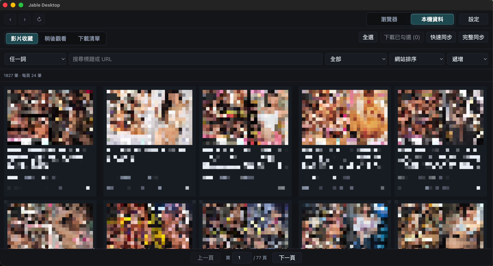

# Jable Desktop

Unofficial local-first desktop app for syncing, browsing, searching, importing, exporting, and downloading Jable favourites and watch-later lists.

<p align="center">
  
</p>

<p align="center">
  <a href="docs/README.zh-TW.md">繁體中文</a>
  ·
  <a href="docs/README.en-US.md">English</a>
  ·
  <a href="docs/README.ja-JP.md">日本語</a>
</p>

---

## Overview

Jable Desktop opens Jable inside an embedded browser and syncs your favourites and watch-later lists into a local SQLite database. It keeps browsing and sign-in directly between you and Jable, while the app provides local search, sorting, backup, restore, and download workflows.

## Highlights

- Sync favourites and watch-later lists
- Embedded multi-tab browser with persistent Jable session storage
- Automatic fallback from `jable.tv` to `fs1.app` when the primary site fails to load
- Local SQLite storage with FTS5 search
- Quick sync and full sync modes
- JSON import/export for desktop backups
- Download List and local video file management
- Lightweight Traditional Chinese / English / Japanese localization across the desktop UI
- macOS and Windows release targets

## Quick Start

Download the latest release from GitHub Releases, open Jable Desktop, sign in to Jable inside the embedded browser, then open Local Data and run Quick Sync.

Full usage guides:

- [繁體中文使用說明](docs/README.zh-TW.md)
- [English User Guide](docs/README.en-US.md)
- [日本語ユーザーガイド](docs/README.ja-JP.md)

## Development

Developer notes, architecture details, validation checklists, and packaging instructions live in [docs/development.md](docs/development.md).

```sh
npm install
fnm exec --using 24 npm run check
```

## Disclaimer

> **This tool is provided only for learning and technical research.** Users are responsible for complying with local laws and respecting content copyright. The developer is not responsible for legal liability arising from use of this tool. Do not use this tool for illegal or infringing purposes.

## Acknowledgements

The download feature and download workflow design reference [hcjohn463/JableDownload](https://github.com/hcjohn463/JableDownload). This project is not a fork of that project; the related implementation is integrated into Jable Desktop's Electron / Rust architecture.

## License

Copyright 2026 shane-zeng.

Licensed under the Apache License 2.0. See [LICENSE](LICENSE).
